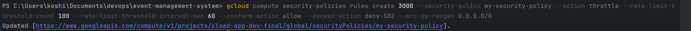

# Google Cloud SDK and Cloud Shell Setup

## Google Cloud SDK Installation
1. Installed SDK from the [official site](https://cloud.google.com/sdk/docs/install).
2. Initialized SDK using:
   ```bash
   gcloud init
   ```
---

## Sample Commands
1. Created a virtual machine:
    ```bash 
   gcloud compute instances create example-vm \
    --zone=us-central1-a \
    --machine-type=e2-micro \
    --image-family=debian-11 \
    --image-project=debian-cloud
    ```
2. Listed resources:
    ```bash
   gcloud compute instances list
    ```
3. Deleted the virtual machine:
    ```bash
   gcloud compute instances delete example-vm --zone=us-central1-a

