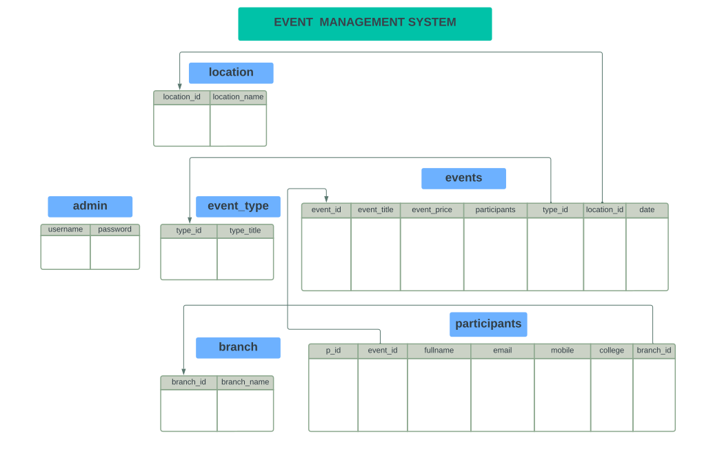

# Schema Overview

## Tables and Relationships:

- defines different categories of events.
- location stores locations for events.
- branch represents departments or branches.
- events is the core table linking event types and locations, while also storing other event-specific data. 
- participants links to events and branch, capturing participant details.
- admin holds admin login credentials.

## Relationships:
- event_type and location have a one-to-many relationship with events.
- branch and events have a many-to-many relationship mediated through participants.





# Constraints:

## CRUD Operations

1. Create (Insert)
Add a new event:
   ```sql
   INSERT INTO `events` (`event_title`, `event_price`, `participants`, `type_id`, `location_id`, `date`)
   VALUES ('CodeSprint', 100, 5, 1, 2, '2024-01-15');
   ```
Add a participant:
   ```sql
   INSERT INTO `participants` (`event_id`, `fullname`, `email`, `mobile`, `college`, `branch_id`)
   VALUES (1, 'John Doe', 'johndoe@example.com', '9876543210', 'XYZ University', 2); 
   ```
   
2. Read (Retrieve)
List all events with their locations and types:
   ```sql
   SELECT e.event_title, e.date, l.location_name, et.type_title
   FROM events e
   JOIN location l ON e.location_id = l.location_id
   JOIN event_type et ON e.type_id = et.type_id;
   ```
Retrieve participants of a specific event:
   ```sql
   SELECT p.fullname, p.email, b.branch_name
   FROM participants p
   JOIN branch b ON p.branch_id = b.branch_id
   WHERE p.event_id = 1;
   ```
3. Update
Update event details:
   ```sql
   UPDATE events
   SET event_price = 75, participants = 10
   WHERE event_id = 2;
   ```
Update participant information:
   ```sql
   UPDATE participants
   SET email = 'newemail@example.com'
   WHERE p_id = 3;
   ```
4. Delete
Delete an event (cascades to participants):
   ```sql
   DELETE FROM events
   WHERE event_id = 1;
   ```
Remove a participant:
   ```sql
   DELETE FROM participants
   WHERE p_id = 5;
   ```
