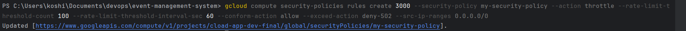

1. HTTPS Configuration
In production, ensure that your Flask application is served over HTTPS to encrypt the data between the client and server. You can use Google Cloud Load Balancer or App Engine to set up SSL certificates.

a. Configuring HTTPS with Google Cloud App Engine
If you are deploying on Google Cloud App Engine, it automatically handles SSL certificates for you, but you need to ensure your app is correctly set up.

2. DB Accessable only from Allowed CIDR blocks or for App Engine User (you should define it by given him appropriate roles):



3. Enable  monitoring your application and logs to detect security issues.

4. Google Cloud Armor API
a. Create a Security Policy:
```python
gcloud compute security-policies create my-security-policy --description "My Cloud Armor policy" --global
```
b. Add Rules to the Security Policy
```shell
gcloud compute security-policies rules create 1000 \
  --security-policy my-security-policy \
  --src-ip-ranges "203.0.113.0/24" \
  --action allow
```
Rate Limiting Rule:
```shell
gcloud compute security-policies rules create 3000 \
  --security-policy my-security-policy \
  --action throttle \
  --rate-limit-threshold-count 100 \
  --rate-limit-threshold-interval-sec 60 \
  --conform-action allow \
  --exceed-action deny-502 \
  --src-ip-ranges 0.0.0.0/0
```


